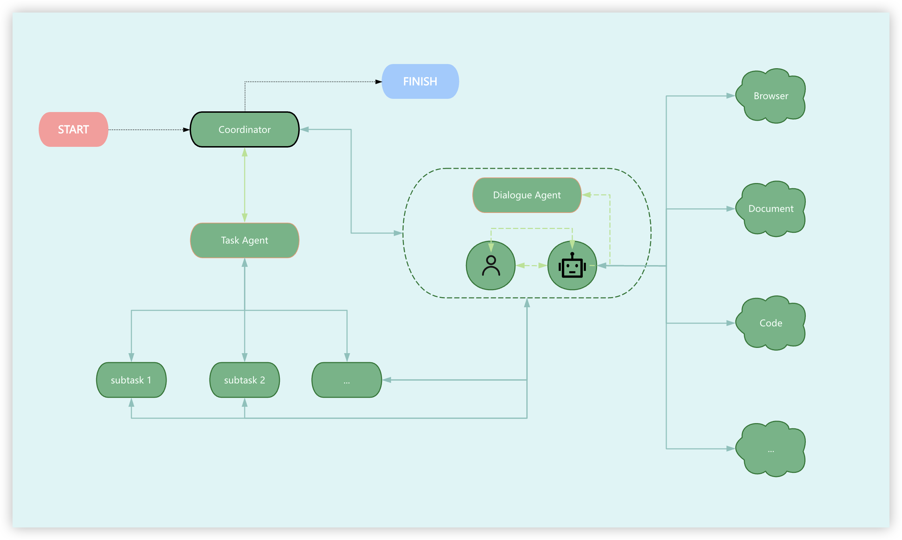

# LuguManus

[English](./README.en.md)
[繁體中文](./README.zh-TW.md)
[简体中文](../README.md)
[日本語](./README.ja.md)

LuguManus is an intelligent desktop application framework built with Electron and TypeScript, deeply integrating advanced large language models with practical tool components to create a powerful automation and assistance system.


## Key Features

- **Multi-agent Collaboration Mechanism**: Utilizes a three-layer architecture of basic agents, dialogue agents, and task-oriented agents to solve complex problems through collaborative work modes.
- **Intelligent Task Decomposition**: Automatically decomposes complex tasks into multiple executable subtasks and executes them in sequence or by dependency.
- **Toolchain Integration**: Built-in tool components for web search, document processing, chart generation, and code execution.
- **Responsive Data Flow**: A responsive architecture built on RxJS, providing smooth asynchronous message processing capabilities.
- **Browser Simulation Interaction**: Simulates browser behavior through Electron, capable of web browsing, content extraction, and executing web actions.
- **Multi-model Support**: Supports different types of AI models (text, long text, code, image recognition, etc.).

## Technology Stack

- Electron desktop application framework
- TypeScript type safety
- Prisma ORM + SQLite data persistence
- RxJS reactive programming
- OpenAI SDK model integration (Qwen)

## Application Scenarios

LuguManus is suitable for various desktop application scenarios requiring AI assistance, including but not limited to:

- Intelligent document processing and analysis
- Automated network information retrieval and integration
- Complex task planning and execution
- Code assistance and execution
- ...

We are continuously improving this framework and welcome developers to contribute and build a stronger AI desktop tool ecosystem together.

## Table of Contents

- [Quick Start](#quick-start)
- [Project Structure](#project-structure)
- [Architecture Design](#architecture-design)
- [Installation Setup](#installation-setup)
- [Contribution Guide](#contribution-guide)
- [License](#license)
- [Acknowledgments](#acknowledgments)
- [Contact Me](#contact-me)

## Quick Start

1. Install dependencies

```bash
# Clone the project
git clone https://github.com/electron-manus/lugumanus.git
cd lugumanus

# Install dependencies
bun install

# Build packages
bun run build-deps

# Run renderer process
bun nx run @lugu-manus/renderer:dev

# Run main process
bun nx run @lugu-manus/main:dev
```

## Project Structure

```bash
lugumanus/
├── apps/                       # Application directory
│   ├── main/                   # Electron main process
│   │   ├── src/                # Main process source code
│   │   │   ├── agent/          # Agent system (basic agent, dialogue agent, task agent)
│   │   │   ├── model/          # Model integration (chat completion, etc.)
│   │   │   ├── toolkits/       # Toolkit collection
│   │   │   │   ├── search-toolkit/      # Search tool integration
│   │   │   │   ├── chart-toolkit/       # Chart generation tool
│   │   │   │   ├── document-toolkit/    # Document processing tool (Markdown, Excel, PPT)
│   │   │   │   └── code-toolkit/        # Code execution tool
│   │   │   ├── routers/        # tRPC API routes
│   │   │   ├── studio-preload/ # Studio preload scripts
│   │   │   ├── window.ts       # Window management
│   │   │   ├── main.ts         # Main process entry
│   │   │   └── preload.ts      # Preload scripts
│   │   ├── prisma/             # Prisma ORM related
│   │   │   └── schema.prisma   # Database model definition
│   │   └── scripts/            # Build scripts
│   └── renderer/               # Renderer process (frontend UI)
│       └── src/
│           └── components/     # React components
│               └── studio/     # Studio related components
│
├── packages/                   # Reusable module packages
│   ├── electron-browseruse/    # Browser automation tools
│   │   ├── src/                # Browser tool source code
│   │   └── README.md           # Browser tool documentation
│   ├── shrink-dom/             # DOM processing tools
│   │   └── src/                # DOM processing source code
│   └── share/                  # Shared tools and components
│
├── package.json                # Project dependencies and scripts
├── nx.json                     # Nx configuration
├── commitlint.config.js        # Commit convention configuration
├── .gitignore                  # Git ignore configuration
└── README.md                   # Project documentation
```

### Core Directory Description

- **apps/main**: Contains Electron main process code and backend logic
  - Agent System (`agent/`): Implements multi-agent collaborative work mechanism
  - Toolkits (`toolkits/`): Various functional tool implementations
  - Database (`prisma/`): Manages data using Prisma ORM and SQLite

- **apps/renderer**: Contains frontend interface code, implemented with React

- **packages/electron-browseruse**: Browser automation toolkit, supports AI-driven web interaction

- **packages/shrink-dom**: DOM processing toolkit, optimizes web content extraction and analysis
  
- **packages/share**: Code and types shared between main and renderer processes

## Architecture Design



## Installation Setup

## Contribution Guide

We warmly welcome community members to participate in the development and improvement of the LuguManus project. Here is the basic process for contributing:

1. **Fork the project repository**: Fork this project on GitHub to your account
2. **Clone your fork**: `git clone https://github.com/YOUR-USERNAME/lugumanus.git`
3. **Create a feature branch**: `git checkout -b feature/your-feature-name`
4. **Submit your changes**:
   - Follow the [Conventional Commits](https://www.conventionalcommits.org/) specification
5. **Push to your fork**: `git push origin feature/your-feature-name`
6. **Create a Pull Request**: From your branch to the main branch of the main repository

### Code Standards

- Write all code in TypeScript
- Follow the existing code style and patterns of the project, use Biome for code formatting
- Write tests for new features
- Update relevant documentation

### Reporting Issues

If you find a bug or have a new feature suggestion, please submit it through GitHub Issues and provide as much detail as possible:
- Clear problem description
- Steps to reproduce
- Expected and actual behavior
- Screenshots or logs (if applicable)
- System environment information

## License

The LuguManus project is open-sourced under the [MIT License](../LICENSE).

## Acknowledgments

The realization of the LuguManus project is supported by the following open-source projects and technologies:

- [Electron](https://www.electronjs.org/) - Provides a cross-platform desktop application development framework
- [TypeScript](https://www.typescriptlang.org/) - Enhances code type safety
- [React](https://reactjs.org/) - User interface development
- [Prisma](https://www.prisma.io/) - Database ORM
- [RxJS](https://rxjs.dev/) - Reactive programming library
- [OpenAI](https://openai.com/) - AI model technology support
- [Nx](https://nx.dev/) - Build system and project management

## Special Thanks

- [CAMEL](https://github.com/camel-ai/camel) - Large model framework

Special thanks to all developers who contributed to the project and community members who provided valuable feedback.

## Contact Me

- **Project Maintainer**: WeChat (taixw2)
- **Email**: fex@0000o.net
- **GitHub**: [https://github.com/electron-manus]

We look forward to your feedback and suggestions to create better AI desktop tools together. 